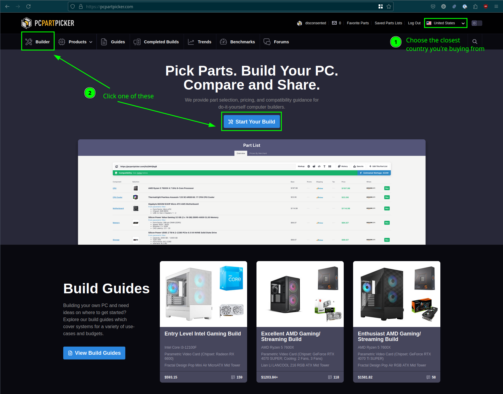
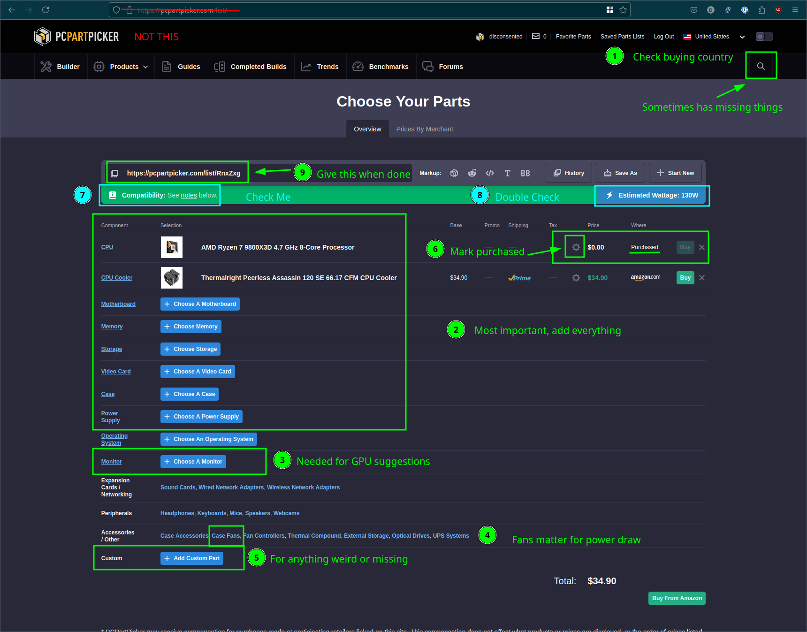
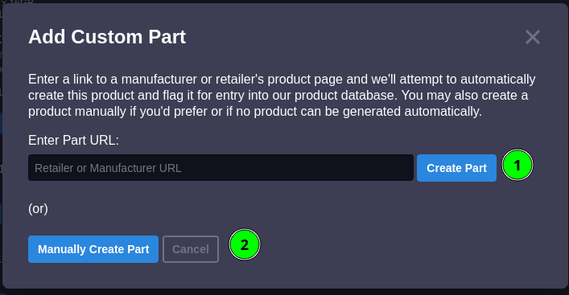
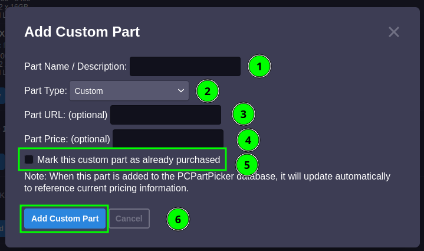
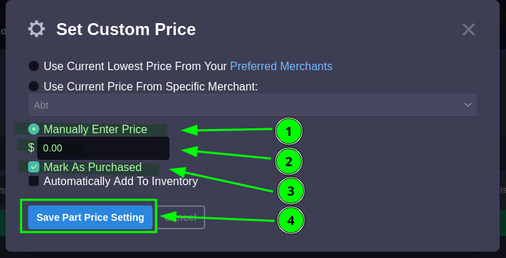

+++
title = "How To PcPartPicker"
date =  2025-01-02T21:23:05.469
updated = 2025-01-02T21:23:05.469
draft = false
[taxonomies]
year = ["2025"]
+++

Often, I need to explain to folks what's expected when I ask for a "pcpartpicker list". I've also gotten tired of playing
20 questions trying to wrangle out the information that I care about. So, here's a quick and dirty guide to PcPartPicker
lists™.

<!-- more -->

## Why use PCPartPicker?

PCPartPicker is a _free_ pc part selection, pricing and compatibility checking. It has become the de-facto tool for
reliably putting together the right parts list for your upgrade or fresh pc build.

## Yes this is an exercise in reading comprehension!

### 1. Choose the closest country.

The country tells us parts availability and prices, these do vary regularly. For this, reason, It's important to pick
the country you're _purchasing from_.

### 2. Select either highlighted button to go to https://[REGION.]pcpartpicker.com/list/

### 3. Check your purchasing country.

### 4. Add everything.

Cherry-picking parts leaves out possibly important context, it only takes a moment on your part to populate these.

### 5. Add your monitor.

This helps us suggest an appropriate GPU, as, there's little point in purchasing a top-end GPU for a 10-year-old
display, when it'll spend its life sitting idle and not putting your dollars to good use.

### 6. Add your case fans.

Every watt matters, consequently for the power estimate to be accurate, we need to account for everything that can draw
power.

### 7. Missing part?

Sometimes parts don't appear as expected, you may be able to find this using the search utility in the top right of the
UI.

Alternatively, you may wish to add a custom part.

### 7a. Create part by URL.

Add a URL and PCPartPicker tries to work out what the part is for you. These parts typically appear in the "Custom Part"
type.

### 7b. Manually Create Part.

Broadly preferable to the first option, this lets us choose the name and type for a given part.

### 8. Mark parts as purchased.

_Always_ mark purchased parts as purchased, even if everything is purchased. This makes it clear what parts will be
replaced/need to be filled out and those that don't.

### 9. Check compatibility warnings.

Most of these are straightforward, when in doubt, ask for help.

### 10. Power estimates.

Not a comprehensive estimation but, it provides a good _minimum_ wattage to work from. Ensure that whatever you pick can
handle the _peak_ power of the system to avoid tripping power supply protections and give you some headroom for
degradation, upgrades, etc.

### 11. Provide the correct link.

Do _not_ provide `pcpartpicker.com/list/`, the parts here are stored in your web browser, and we will not see what you do.

Instead, provide the `pcpartpicker.com/list/######` link, in the green box.